# Modelagem do Sistema

Este documento descreve a modelagem de dados, arquitetura do sistema e fluxos principais da StudiesAPI.

## Modelos de Dados

### Visão Geral

A API utiliza dois modelos principais para persistência de dados:

- **User**: Representa os usuários do sistema
- **Session**: Representa as sessões de estudo

### Diagrama Entidade-Relacionamento (ERD)

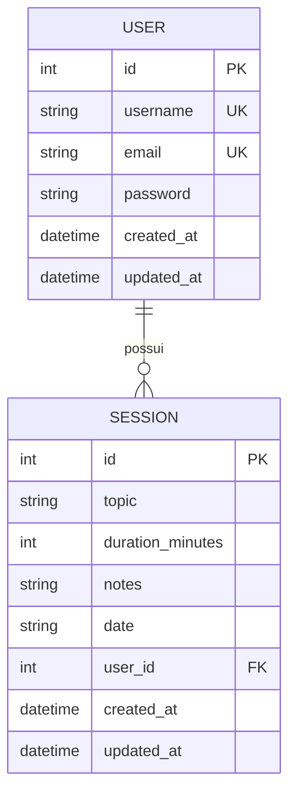

### Modelo User

**Tabela:** `users`

| Coluna | Tipo | Restrições | Descrição |
|--------|------|------------|-----------|
| `id` | INTEGER | PRIMARY KEY, AUTOINCREMENT | Identificador único |
| `username` | VARCHAR | UNIQUE, NOT NULL | Nome de usuário |
| `email` | VARCHAR | UNIQUE, NOT NULL | Email do usuário |
| `password` | VARCHAR | NOT NULL | Senha (hash Argon2) |
| `created_at` | DATETIME | DEFAULT CURRENT_TIMESTAMP | Data de criação |
| `updated_at` | DATETIME | DEFAULT CURRENT_TIMESTAMP, ON UPDATE | Data de atualização |

**Relacionamentos:**
- One-to-Many com `Session` (um usuário tem várias sessões)

**Validações:**
- Username: mínimo 6 caracteres
- Email: formato válido (EmailStr)
- Password: mínimo 8 caracteres

### Modelo Session

**Tabela:** `sessions`

| Coluna | Tipo | Restrições | Descrição |
|--------|------|------------|-----------|
| `id` | INTEGER | PRIMARY KEY, AUTOINCREMENT | Identificador único |
| `topic` | VARCHAR | NOT NULL | Tópico estudado |
| `duration_minutes` | INTEGER | NOT NULL | Duração em minutos |
| `notes` | TEXT(120) | NULLABLE | Anotações (máx 120 chars) |
| `date` | VARCHAR | NOT NULL | Data da sessão |
| `user_id` | INTEGER | FOREIGN KEY → users.id | ID do usuário |
| `created_at` | DATETIME | DEFAULT CURRENT_TIMESTAMP | Data de criação |
| `updated_at` | DATETIME | DEFAULT CURRENT_TIMESTAMP, ON UPDATE | Data de atualização |

**Relacionamentos:**
- Many-to-One com `User` (várias sessões pertencem a um usuário)

**Validações:**
- Topic: obrigatório
- Duration: inteiro positivo
- Notes: opcional, máximo 120 caracteres
- Date: formato string (YYYY-MM-DD recomendado)

---

## Arquitetura do Sistema

### Arquitetura em Camadas

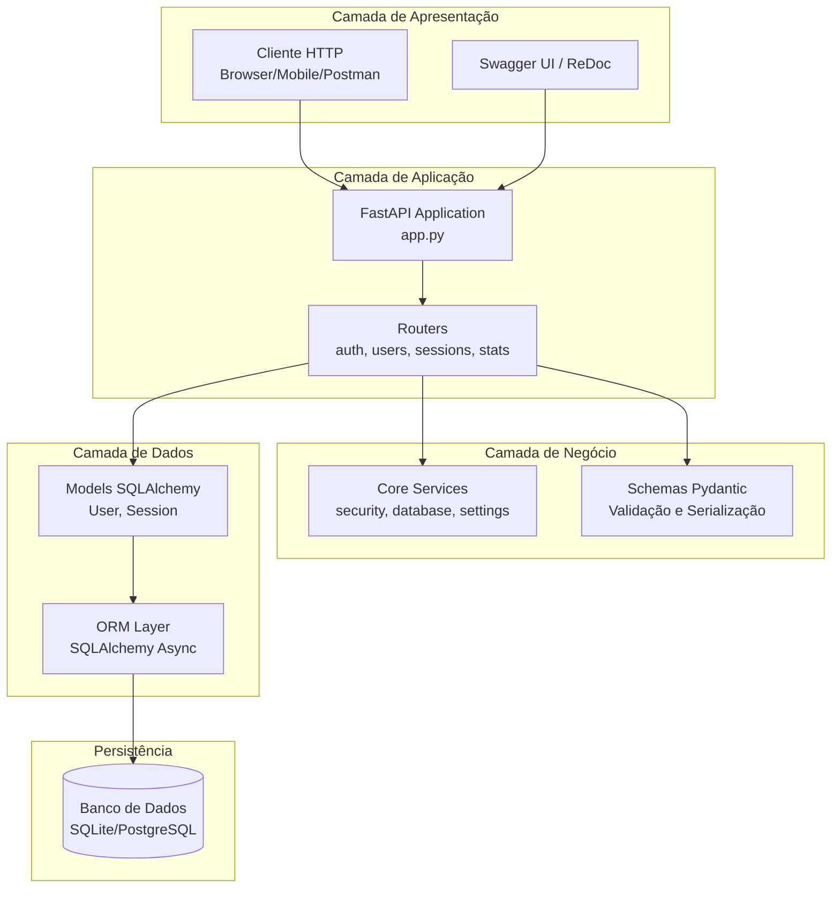

### Fluxo de Requisição

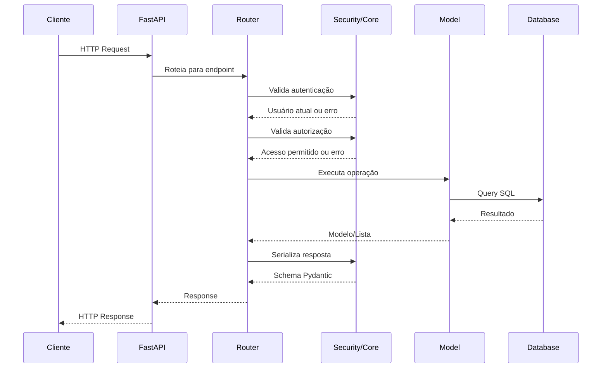

---

## Fluxo de Autenticação

### Diagrama de Autenticação

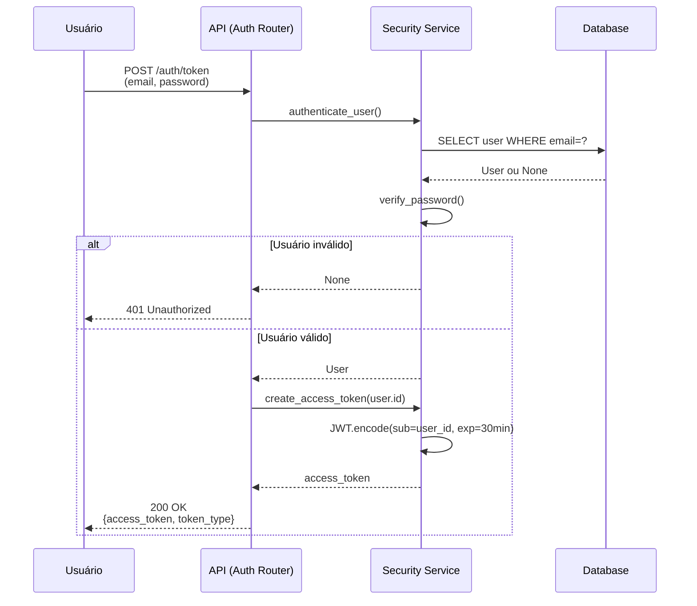

### Fluxo de Refresh de Token

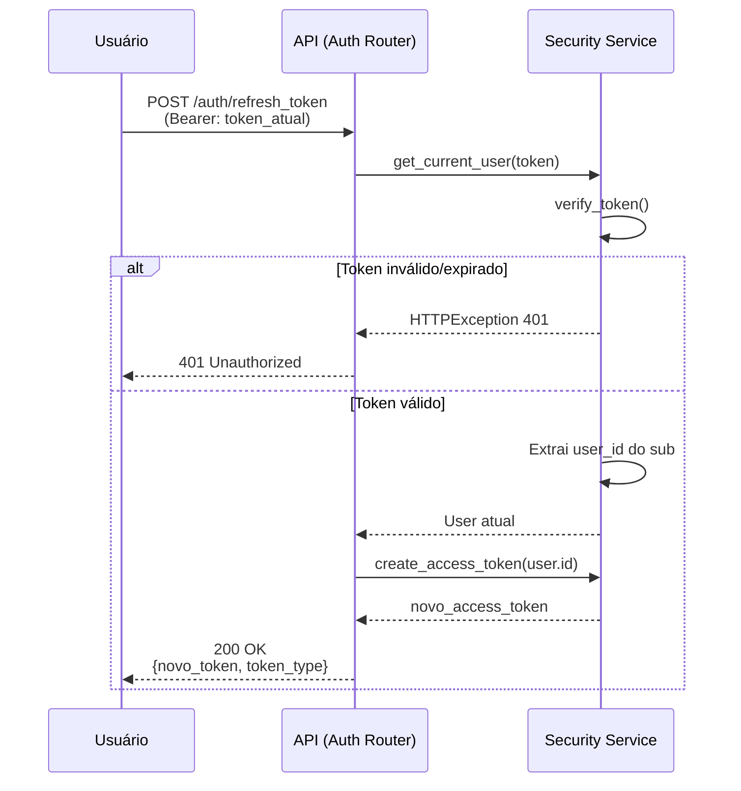

### Validação de Token

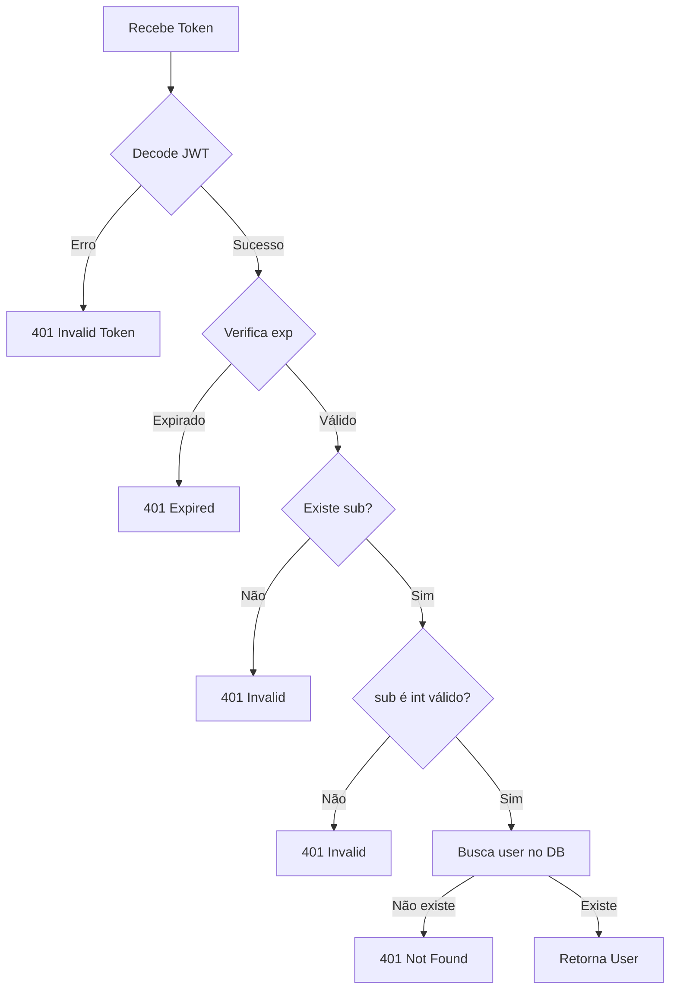

---

## Fluxo CRUD de Sessões de Estudo

### Criar Sessão

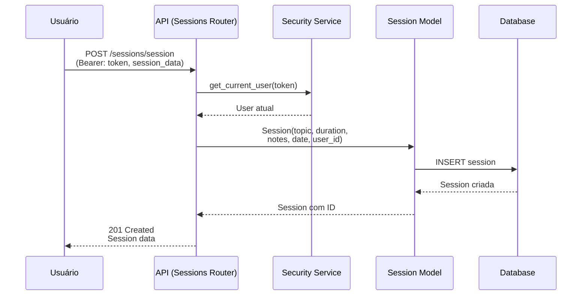

### Listar Sessões

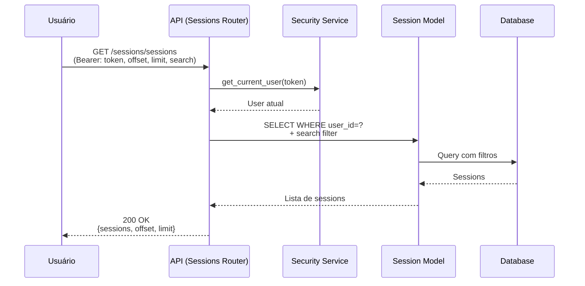

### Buscar Sessão por ID

```mermaid
flowchart TD
    A[GET /sessions/{id}] --> B[Autenticar usuário]
    B --> C[Buscar sessão no DB]
    C --> D{Sessão existe?}
    D -->|Não| E[404 Not Found]
    D -->|Sim| F{user_id == current_user.id?}
    F -->|Não| G[403 Forbidden]
    F -->|Sim| H[200 OK<br/>Session data]
```

### Atualizar Sessão

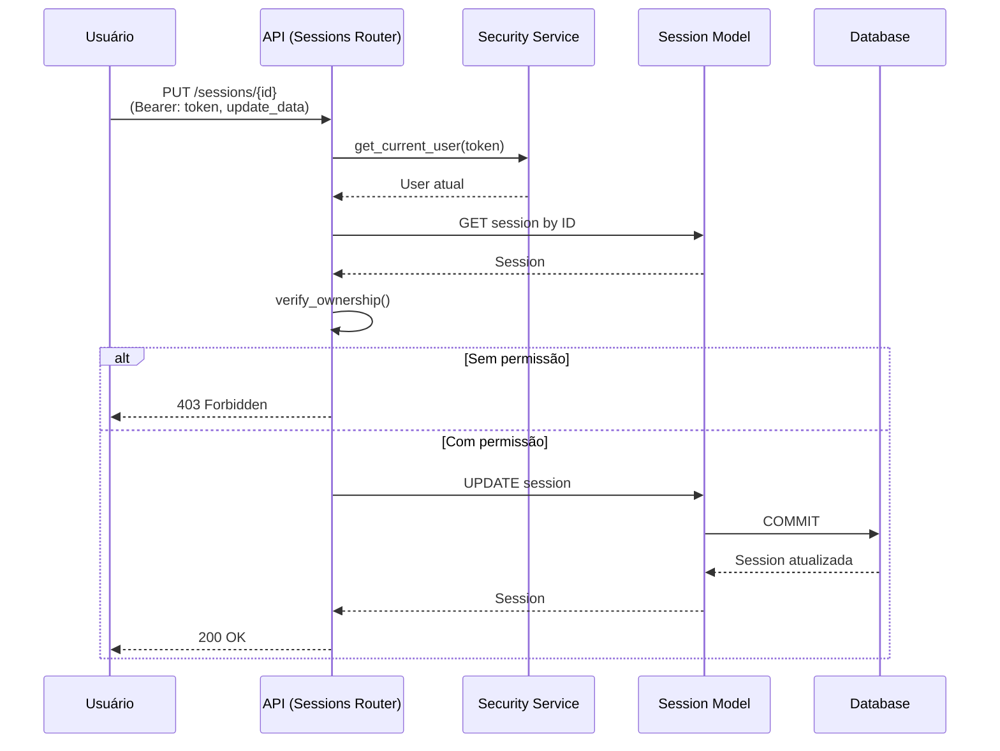

### Deletar Sessão

```mermaid
flowchart TD
    A[DELETE /sessions/{id}] --> B[Autenticar usuário]
    B --> C[Buscar sessão no DB]
    C --> D{Sessão existe?}
    D -->|Não| E[404 Not Found]
    D -->|Sim| F{user_id == current_user.id?}
    F -->|Não| G[403 Forbidden]
    F -->|Sim| H[DELETE session]
    H --> I[COMMIT]
    I --> J[204 No Content]
```

---

## Fluxo de Segurança

### Hash de Senha

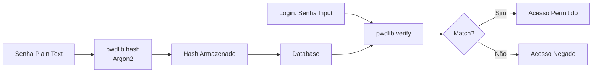

### Validação de Ownership

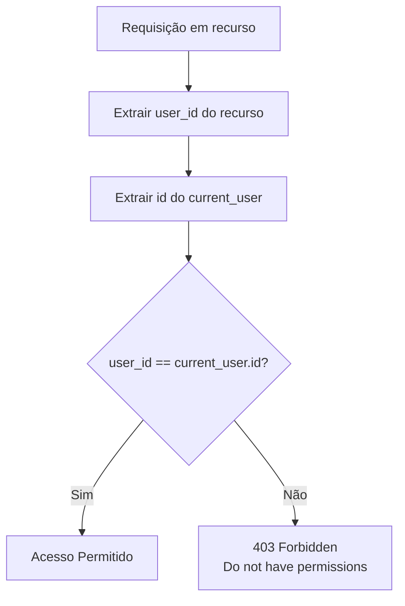

---

## Schemas Pydantic

### Hierarquia de Schemas

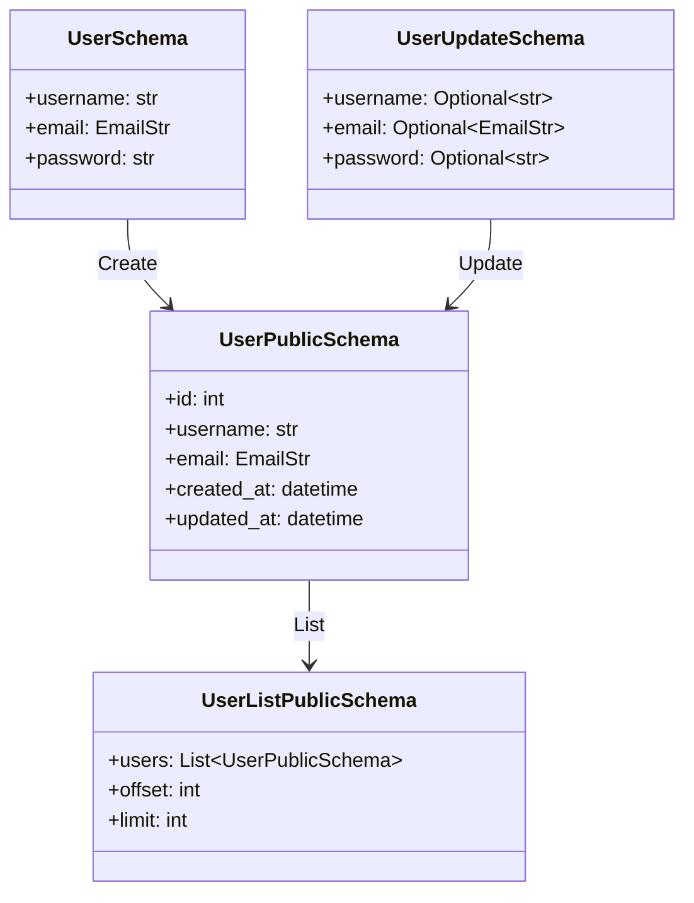

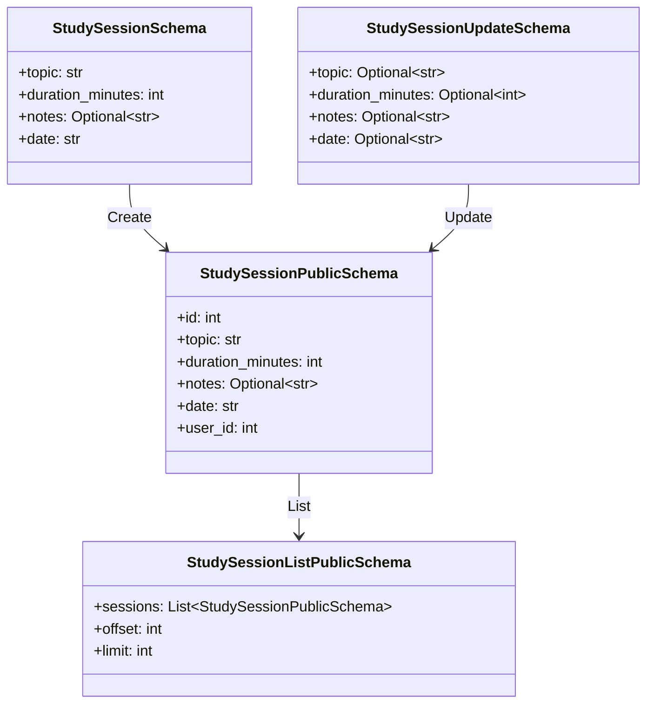

---

## Configurações do Sistema

### Settings

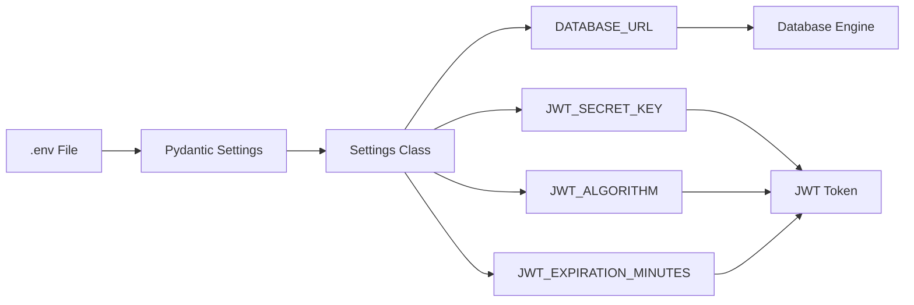

---

## Próximos Passos

1. [Segurança](security.md) - Detalhes de autenticação e segurança
2. [Desenvolvimento](development.md) - Guia de desenvolvimento
3. [Deploy](deploy.md) - Instruções de implantação
