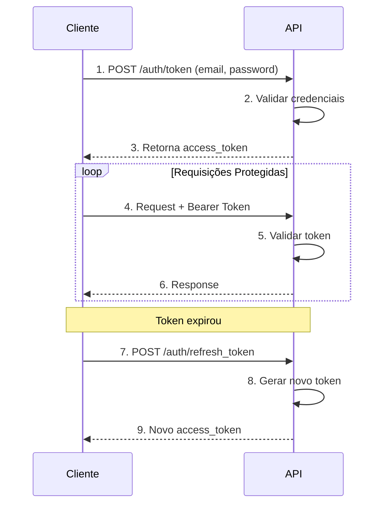

# Autenticação e Segurança

Este documento descreve os mecanismos de autenticação e segurança implementados na StudiesAPI.

## Visão Geral

A API utiliza os seguintes mecanismos de segurança:

1. **JWT (JSON Web Tokens)** para autenticação stateless
2. **Argon2** para hash de senhas
3. **Validação de Ownership** para autorização de recursos
4. **HTTPS** recomendado para produção

---

## Autenticação JWT

### O que é JWT?

JWT (JSON Web Token) é um padrão aberto (RFC 7519) para transmissão segura de informações entre partes como um objeto JSON.

### Estrutura do Token

```
eyJhbGciOiJIUzI1NiIsInR5cCI6IkpXVCJ9.
eyJzdWIiOiIxIiwiZXhwIjoxNzEwODc2MDAwfQ.
SflKxwRJSMeKKF2QT4fwpMeJf36POk6yJV_adQssw5c
```

**Partes:**
1. **Header**: Algoritmo e tipo de token
2. **Payload**: Dados (claims)
3. **Signature**: Assinatura para validação

### Claims Utilizadas

| Claim | Descrição | Exemplo |
|-------|-----------|---------|
| `sub` | Subject (ID do usuário) | `"1"` |
| `exp` | Expiration Time | `1710876000` |

### Configuração JWT

```python
# studies_api/core/settings.py
class Settings(BaseSettings):
    JWT_SECRET_KEY: str
    JWT_ALGORITHM: str = 'HS256'
    JWT_EXPIRATION_MINUTES: int = 30
```

### Fluxo de Autenticação



### Implementação

#### Criar Token de Acesso

```python
# studies_api/core/security.py
def create_access_token(data: Dict) -> str:
    to_encode = data.copy()
    expire = datetime.now(timezone.utc) + timedelta(
        minutes=settings.JWT_EXPIRATION_MINUTES
    )
    to_encode.update({'exp': expire})
    
    encoded_jwt = jwt.encode(
        payload=to_encode,
        key=settings.JWT_SECRET_KEY,
        algorithm=settings.JWT_ALGORITHM,
    )
    
    return encoded_jwt
```

#### Verificar Token

```python
def verify_token(token: str) -> Dict:
    try:
        payload = jwt.decode(
            jwt=token,
            key=settings.JWT_SECRET_KEY,
            algorithms=[settings.JWT_ALGORITHM],
        )
        return payload
    except jwt.ExpiredSignatureError:
        raise HTTPException(
            status_code=status.HTTP_401_UNAUTHORIZED,
            detail='Expired Token',
            headers={'WWW-Authenticate': 'Bearer'},
        )
    except jwt.InvalidTokenError:
        raise HTTPException(
            status_code=status.HTTP_401_UNAUTHORIZED,
            detail='Could Not validate credentials',
            headers={'WWW-Authenticate': 'Bearer'},
        )
```

#### Obter Usuário Atual

```python
async def get_current_user(
    credentials: HTTPAuthorizationCredentials = Depends(security),
    db: AsyncSession = Depends(get_connection),
) -> User:
    payload = verify_token(token=credentials.credentials)
    user_id_str = payload.get('sub')
    
    if not user_id_str:
        raise HTTPException(
            status_code=status.HTTP_401_UNAUTHORIZED,
            detail='Could not validate credentials',
        )
    
    try:
        user_id = int(user_id_str)
    except (ValueError, TypeError):
        raise HTTPException(
            status_code=status.HTTP_401_UNAUTHORIZED,
            detail='Could not validate credentials',
        )
    
    result = await db.execute(select(User).where(User.id == user_id))
    user = result.scalar_one_or_none()
    
    if not user:
        raise HTTPException(
            status_code=status.HTTP_401_UNAUTHORIZED,
            detail='Could not validate credentials',
        )
    
    return user
```

### Uso em Endpoints

```python
@router.get('/protected')
async def protected_route(
    current_user: User = Depends(get_current_user)
):
    # current_user está disponível
    return {'user_id': current_user.id}
```

---

## Hash de Senhas

### Argon2

A API utiliza **Argon2** (vencedor do Password Hashing Competition) através da biblioteca `pwdlib`.

### Configuração

```python
from pwdlib import PasswordHash

pwd_context = PasswordHash.recommended()
```

### Hash de Senha

```python
def get_password_hash(password: str) -> str:
    return pwd_context.hash(password)
```

**Exemplo:**
```python
plain_password = "minhasenha123"
hashed_password = get_password_hash(plain_password)
# Resultado: $argon2id$v=19$m=65536,t=3,p=4$...
```

### Verificação de Senha

```python
def verify_password(plain_password: str, hashed_password: str) -> bool:
    return pwd_context.verify(plain_password, hashed_password)
```

**Exemplo:**
```python
is_valid = verify_password("minhasenha123", hashed_password)
# Retorna: True ou False
```

### Autenticação de Usuário

```python
async def authenticate_user(
    email: str,
    password: str,
    db: AsyncSession,
) -> Optional[User]:
    result = await db.execute(select(User).where(User.email == email))
    user = result.scalar_one_or_none()
    
    if not user:
        return None
    
    if not verify_password(password, user.password):
        return None
    
    return user
```

### Validações de Senha

```python
class UserSchema(BaseModel):
    password: str
    
    @field_validator('password')
    def password_min_length(cls, v):
        if len(v) < 8:
            raise ValueError('Password must have more than 7 characters.')
        return v
```

---

## Autorização

### Validação de Ownership

Cada usuário só pode acessar seus próprios recursos (sessões de estudo).

```python
def verify_study_session_ownership(
    study_session: Session,
    current_user: User,
):
    if study_session.user_id != current_user.id:
        raise HTTPException(
            status_code=status.HTTP_403_FORBIDDEN,
            detail='Do not have permissions to access this study session',
        )
```

### Uso em Endpoints

```python
@router.get('/sessions/{session_id}')
async def get_session(
    session_id: int,
    db: AsyncSession = Depends(get_connection),
    current_user: User = Depends(get_current_user),
):
    study_session = await db.get(Session, session_id)
    
    if not study_session:
        raise HTTPException(
            status_code=status.HTTP_404_NOT_FOUND,
            detail='Study Session Not Found',
        )
    
    # Valida ownership
    verify_study_session_ownership(
        study_session=study_session,
        current_user=current_user,
    )
    
    return study_session
```

---

## Segurança em Endpoints

### Endpoints Públicos

| Endpoint | Método | Segurança |
|----------|--------|-----------|
| `/health_check` | GET | Nenhum |
| `/api/v1/auth/token` | POST | Nenhum |
| `/api/v1/users/` | POST | Nenhum (criação) |

### Endpoints Privados

| Endpoint | Método | Segurança |
|----------|--------|-----------|
| `/api/v1/auth/refresh_token` | POST | JWT |
| `/api/v1/users/` | GET | JWT |
| `/api/v1/users/{id}` | GET, PUT, DELETE | JWT |
| `/api/v1/sessions/*` | TODOS | JWT + Ownership |
| `/api/v1/stats/` | GET | JWT |

---

## Códigos de Erro de Segurança

### 401 Unauthorized

Retornado quando:
- Token ausente
- Token inválido
- Token expirado
- Credenciais incorretas

```python
raise HTTPException(
    status_code=status.HTTP_401_UNAUTHORIZED,
    detail='Incorrect email or password',
    headers={'WWW-Authenticate': 'Bearer'},
)
```

### 403 Forbidden

Retornado quando:
- Usuário autenticado mas sem permissão no recurso

```python
raise HTTPException(
    status_code=status.HTTP_403_FORBIDDEN,
    detail='Do not have permissions to access this study session',
)
```

---

## Melhores Práticas Implementadas

### 1. Senhas

- ✅ Hash com Argon2 (algoritmo recomendado)
- ✅ Validação de tamanho mínimo (8 caracteres)
- ✅ Nunca armazenar em texto puro
- ✅ Nunca expor em logs ou respostas

### 2. Tokens JWT

- ✅ Expiração configurada (30 minutos padrão)
- ✅ Assinatura com chave secreta
- ✅ Validação de expiração automática
- ✅ Refresh token para renovação

### 3. Autorização

- ✅ Validação de ownership em recursos
- ✅ Separação entre autenticação e autorização
- ✅ Princípio do menor privilégio

### 4. Headers de Segurança

```python
# Retornar header WWW-Authenticate em erros 401
headers={'WWW-Authenticate': 'Bearer'}
```

---

## Recomendações para Produção

### 1. HTTPS Obrigatório

```bash
# Configurar redirect HTTP → HTTPS
# Usar certificados SSL/TLS válidos
```

### 2. Chave Secreta Forte

```bash
# Gerar chave segura
python -c "import secrets; print(secrets.token_urlsafe(32))"
```

### 3. Tempo de Expiração

- **Desenvolvimento**: 60+ minutos
- **Produção**: 15-30 minutos
- **Refresh**: Implementar blacklist de tokens

### 4. Rate Limiting

```python
# Recomendado: Implementar rate limiting
# from slowapi import Limiter
# limiter = Limiter(key_func=get_remote_address)
```

### 5. CORS

```python
# Configurar origens permitidas
from fastapi.middleware.cors import CORSMiddleware

app.add_middleware(
    CORSMiddleware,
    allow_origins=["https://meudominio.com"],
    allow_credentials=True,
    allow_methods=["*"],
    allow_headers=["*"],
)
```

### 6. Environment Variables

```bash
# .env.production
DATABASE_URL=postgresql+asyncpg://...
JWT_SECRET_KEY=<chave_gerada_segura>
JWT_ALGORITHM=HS256
JWT_EXPIRATION_MINUTES=30
```

---

## Vulnerabilidades Evitadas

| Vulnerabilidade | Como foi evitada |
|----------------|------------------|
| **Senhas em texto puro** | Hash com Argon2 |
| **Token forging** | Assinatura JWT com chave secreta |
| **Token replay** | Expiração de token |
| **Acesso não autorizado** | Validação de ownership |
| **SQL Injection** | SQLAlchemy ORM com parameter binding |
| **Força bruta** | Validação de tamanho de senha |

---

## Checklist de Segurança

- [ ] Gerar JWT_SECRET_KEY forte para produção
- [ ] Configurar HTTPS no servidor
- [ ] Definir tempo de expiração adequado
- [ ] Implementar rate limiting
- [ ] Configurar CORS corretamente
- [ ] Nunca logar senhas ou tokens
- [ ] Manter dependências atualizadas
- [ ] Usar variáveis de ambiente para segredos
- [ ] Implementar blacklist de tokens (opcional)
- [ ] Adicionar headers de segurança (HSTS, CSP, etc.)

---

## Próximos Passos

1. [Desenvolvimento](development.md) - Guia de desenvolvimento
2. [Testes](testing.md) - Execução de testes
3. [Deploy](deploy.md) - Instruções de implantação
